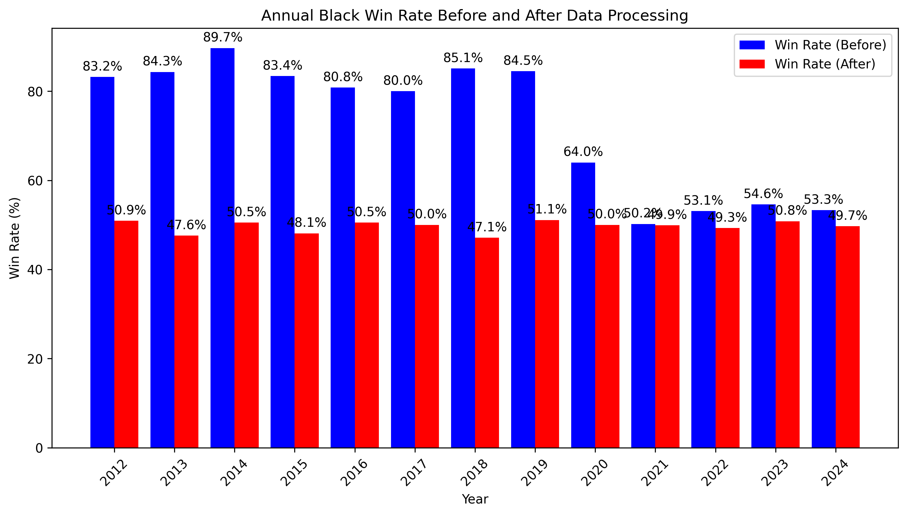

## <한국기원 기사 랭킹과 덤에 관한 분석> 논문 데이터 오류 발견

### 🔹 데이터 수집
- 한국기원 기록실 크롤링: [한국기원 기록실](https://baduk.or.kr/record/diary.asp)

### 🔹 데이터 오류 발견
- 대국 결과가 기록되지 않은 경우 **흑 승**으로 데이터 저장됨
- 따라서 과거 데이터일수록 흑 승률이 비정상적으로 높음

### 🔹 오류 수정 전 흑 승률
- 약 **80%** (데이터 오류로 인해 과대 추정됨)

### 🔹 오류 수정 후 흑 승률
- 약 **50%** (데이터 정제 후 정상 수치)

### 📊 **흑 승률 변화 (전처리 전후)**

